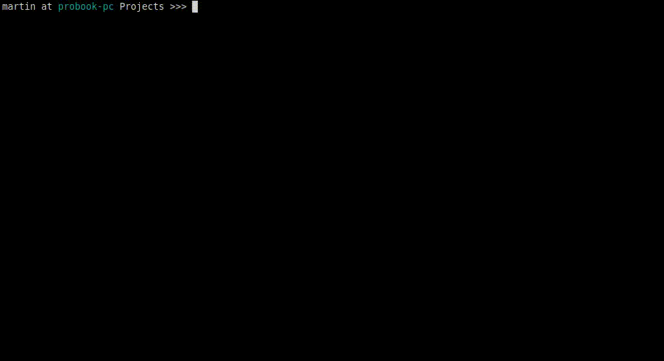

<h1 align="center">Welcome to Flutter-Template-Generator 👋</h1>
<p>
  <a href="https://www.npmjs.com/package/lifecycle" target="_blank">
    
  </a>
  <a href="https://choosealicense.com/licenses/mit/" target="_blank">
    
  </a>
</p>

> Simple tool for create new Flutter project from a template.

## Install

```sh
git clone https://github.com/mjablecnik/Flutter-Template-Generator.git
cd Flutter-Template-Generator
export PATH=$PATH:$(pwd)/bin
```

## Usage

```sh
ftg run           # generate new project in interactive mode
ftg change        # generate new project in sandbox directory for change any template
ftg convert       # convert and save any existing Flutter project into new template
ftg clean         # clean sandbox
ftg help          # get help
```

## Example


## Author

👤 **Martin Jablečník**

* Website: martin-jablecnik.cz
* Github: [@mjablecnik](https://github.com/mjablecnik)

## Show your support

Give a ⭐️ if this project helped you!

<a href="https://www.patreon.com/mjablecnik">
  
</a>

## 📝 License

Copyright © 2021 [Martin Jablečník](https://github.com/mjablecnik).<br />
This project is [MIT](LICENSE) licensed.

***
_This README was generated with ❤️ by [readme-md-generator](https://github.com/kefranabg/readme-md-generator)_

